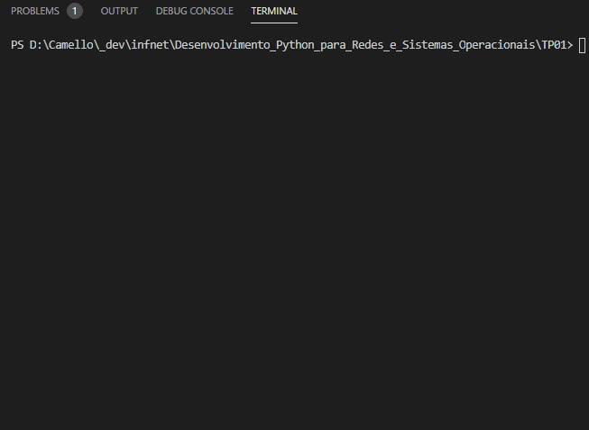
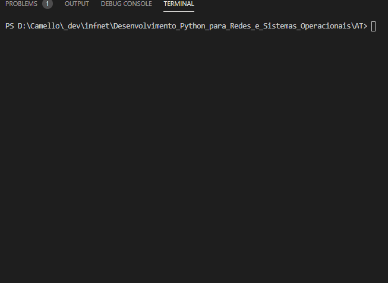
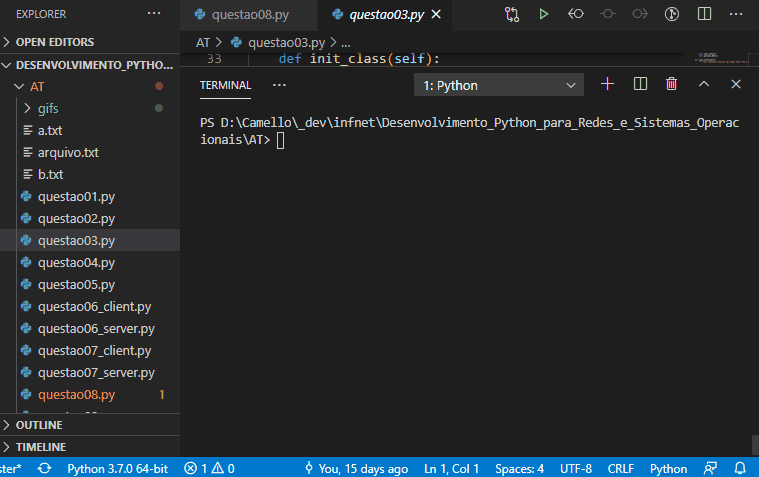
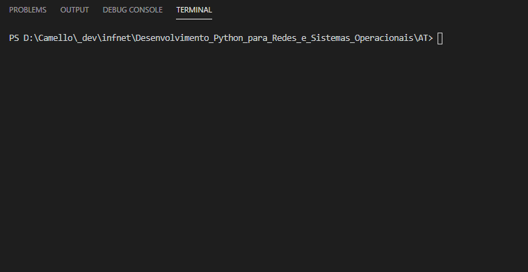
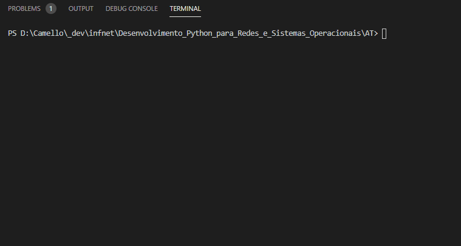
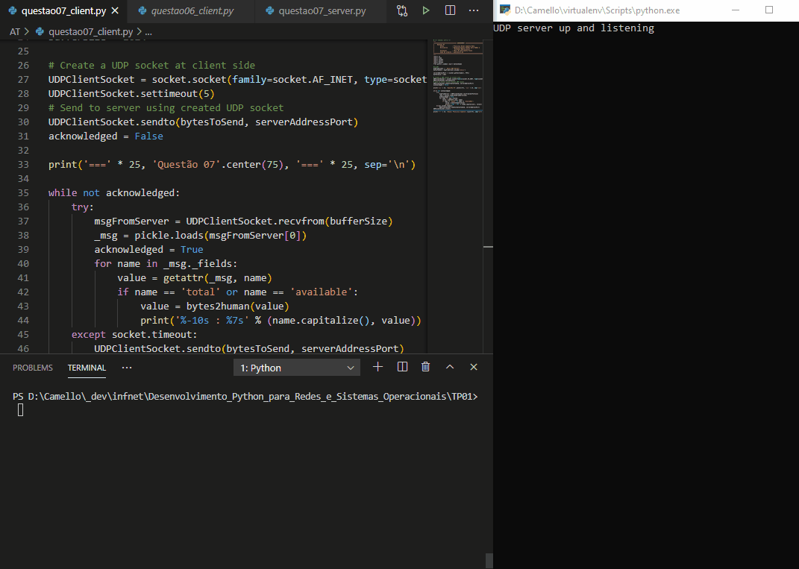

# Desenvolvimento Python para Redes e Sistemas Operacionais

## Assesment

#### 1. Escreva um programa em Python que:
1. obtenha a lista de processos executando no momento, considerando que o processo pode deixar de existir enquanto seu programa manipula suas informações;
1. imprima o nome do processo e seu PID;
1. imprima também o percentual de uso de CPU e de uso de memória.



[Código](https://github.com/franciscocamellon/Desenvolvimento_Python_para_Redes_e_Sistemas_Operacionais/blob/master/AT/questao01.py)


#### 2. Escreva um programa que obtenha um nome de um arquivo texto do usuário e crie um processo para executar o programa do sistema Windows bloco de notas (notepad) para abrir o arquivo.



[Código](https://github.com/franciscocamellon/Desenvolvimento_Python_para_Redes_e_Sistemas_Operacionais/blob/master/AT/questao02.py)


#### 3. Escreva um programa em Python que:
1. gere uma estrutura que armazena o nome dos arquivos em um determinado diretório e a quantidade de bytes que eles ocupam em disco. Obtenha o nome do diretório do usuário;
1. Ordene decrescentemente esta estrutura pelo valor da quantidade de bytes ocupada em disco (pode usar as funções sort ou sorted);
1. gere um arquivo texto com os valores desta estrutura ordenados.



[Código](https://github.com/franciscocamellon/Desenvolvimento_Python_para_Redes_e_Sistemas_Operacionais/blob/master/AT/questao03.py)


#### 4. Escreva um programa em Python que leia um arquivo texto e apresente na tela o seu conteúdo reverso. Exemplo:

#### arquivo.txt

    Bom dia
    Você pode falar agora?

#### Resultado na tela:

    ?aroga ralaf edop êcoV
    aid moB



[Código](https://github.com/franciscocamellon/Desenvolvimento_Python_para_Redes_e_Sistemas_Operacionais/blob/master/AT/questao04.py)


#### 5. Escreva um programa em Python que leia dois arquivos, a.txt e b.txt, como a seguir:

a.txt | b.txt
------------ | -------------
1 15 -42 33 -7 -2 39 8 | 19 56 -43 23 -7 -11 33 21 61 9

#### Seu programa deve somar elemento por elemento de cada arquivo e imprimir o resultado na tela. Isto é, o primeiro elemento de a.txt deve ser somado ao primeiro elemento de b.txt, segundo elemento de a.txt deve ser somado ao segundo elemento de b.txt, e assim sucessivamente. Caso um arquivo tenha mais elementos que o outro, os elementos que sobrarem do maior devem ser somados a zero.




[Código](https://github.com/franciscocamellon/Desenvolvimento_Python_para_Redes_e_Sistemas_Operacionais/blob/master/AT/questao05.py)


#### 6. Escreva um programa cliente e servidor sobre TCP em Python em que:

1. O cliente envia para o servidor o nome de um diretório e recebe a lista de arquivos (apenas arquivos) existente nele.
1. O servidor recebe a requisição do cliente, captura o nome dos arquivos no diretório em questão e envia a resposta ao cliente de volta.


[Código](https://github.com/franciscocamellon/Desenvolvimento_Python_para_Redes_e_Sistemas_Operacionais/blob/master/AT/questao06.py)


#### 7. Escreva um programa cliente e servidor sobre UDP em Python que:

1. O cliente envia para o servidor o pedido de obtenção da quantidade total e disponível de memória no servidor e espera receber a resposta durante 5s. Caso passem os 5s, faça seu programa cliente tentar novamente mais 5 vezes (ainda esperando 5s a resposta) antes de desistir.
1. O servidor repetidamente recebe a requisição do cliente, captura a informação da quantidade total e disponível de memória há no servidor e envia a resposta ao cliente de volta.



[Código](https://github.com/franciscocamellon/Desenvolvimento_Python_para_Redes_e_Sistemas_Operacionais/blob/master/AT/questao07.py)


#### 8. Escreva 3 programas em Python que resolva o seguinte problema:
     Dado um vetor A de tamanho N com apenas números inteiros positivos, calcule o fatorial de cada um deles e armazene o resultado em um vetor B.

#### Para calcular o fatorial, utilize a seguinte função:
```python
def fatorial(n):
  fat = n
  for i in range(n-1,1,-1):
    fat = fat * i
  return(fat)
```
#### Os modos de desenvolver seu programa devem ser:

1. sequencialmente (sem concorrência);
1. usando o módulo threading com 4 threads;
1. usando o módulo multiprocessing com 4 processos.


[Código](https://github.com/franciscocamellon/Desenvolvimento_Python_para_Redes_e_Sistemas_Operacionais/blob/master/AT/questao08.py)


#### 9. Teste todos os 3 programas da questão 8, capture os tempos de execução deles e compare-os, explicando os resultados de tempos. Varie o valor de N em 1.000.000, 5000.000, 10.000.000 (ou escolha números maiores ou melhores de acordo com a velocidade de processamento do computador utilizado para testes).


[Código](https://github.com/franciscocamellon/Desenvolvimento_Python_para_Redes_e_Sistemas_Operacionais/blob/master/AT/questao09.py)

