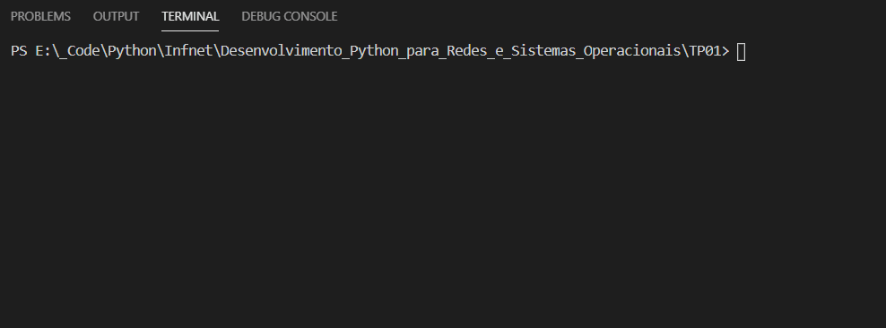

# Desenvolvimento Python para Redes e Sistemas Operacionais

## Teste de Performance 01
Neste TP há questões discursivas e de implementação.

#### 1. Escreva um programa usando o módulo ‘os’ de Python que imprima o nome de usuário.

[Código](https://github.com/franciscocamellon/Desenvolvimento_Python_para_Redes_e_Sistemas_Operacionais/blob/master/TP01/questao01.py)

#### 2. Sobre variáveis de ambiente, responda:
1. O que são?
    
Uma variável de ambiente é um valor nomeado dinamicamente que pode afetar o modo como os processos em execução irão se comportar em um computador. Elas são parte do ambiente no qual um processo executa.

1. Como elas podem ser obtidas pelo módulo ‘os’ de Python?
    
Através do método <b>os.environ</b> que retorna um objeto de mapeamento representando uma string do ambiente, ou através do método <b>os.getenv(<i>key</i>)</b> sendo key a string que representa a variável de ambiente pretendida.

    
Ex.: <b>os.environ</b> <ul><li>environ({'HOMEDRIVE': 'C:', 'HOMEPATH': '\\Users\\Username','PATH': 'C:\\Windows\\system32;C:\\Windows})</ul>

    <b>os.getenv(<i>'HOMEPATH'</i>)</b> <ul><li>\Users\Username</ul>

1. Como pode ser obtido o caminho completo do diretório de usuário em Python, através das variáveis de ambiente?
    
Como descrito no item anterior, acessando no objeto de mapeamento obtido através de <b>os.environ</b> o valor da chave 'HOMEPATH' (<i>os.environ['HOMEPATH']</i>) ou a partir de <b>os.getenv(<i>key</i>)</b> passando como parâmetro key a string 'HOMEPATH'.

#### 3. Escreva um programa usando o módulo ‘os’ de Python que imprima o PID do próprio processo e também seu GID (identificador de grupo) caso seja sistema do tipo Linux.

[Código](https://github.com/franciscocamellon/Desenvolvimento_Python_para_Redes_e_Sistemas_Operacionais/blob/master/TP01/questao03.py)

#### 4. Que função do módulo ‘os’ de Python é usada para obter o caminho absoluto de um diretório com caminho relativo? Dê um exemplo.

A função que é usasda para obter o caminho absoluto de um diretório a partir do caminho relativo é os.path.<b>abspath</b>(<i>path</i>). Ela retorna uma versão normalizada e absolutizada do nome de caminho <i>path</i>, conforme percebe-se no exemplo abaixo:

#### 5. Escreva um programa que indique se um arquivo existe ou não. Caso exista, indique se é realmente um arquivo ou não.

[Código](https://github.com/franciscocamellon/Desenvolvimento_Python_para_Redes_e_Sistemas_Operacionais/blob/master/TP01/questao05.py)

#### 6. Escreva um programa que indique a extensão de um arquivo usando função do módulo os.path.

[Código](https://github.com/franciscocamellon/Desenvolvimento_Python_para_Redes_e_Sistemas_Operacionais/blob/master/TP01/questao06.py)

#### 7. Escreva um programa que imprima apenas o caminho absoluto de um arquivo com nome relativo. A impressão não deve conter o nome do arquivo, apenas o caminho.

[Código](https://github.com/franciscocamellon/Desenvolvimento_Python_para_Redes_e_Sistemas_Operacionais/blob/master/TP01/questao07.py)

#### 8. Escreva um programa que mostre a quantidade de bytes (em KB) de cada arquivo em um diretório.

[Código](https://github.com/franciscocamellon/Desenvolvimento_Python_para_Redes_e_Sistemas_Operacionais/blob/master/TP01/questao08.py)

#### 9. Escreva um programa que mostre as datas de criação e modificação de cada arquivo em um diretório.

[Código](https://github.com/franciscocamellon/Desenvolvimento_Python_para_Redes_e_Sistemas_Operacionais/blob/master/TP01/questao09.py)

#### 10. Os comandos os.exec* e os.spawn* são bastante parecidos. No entanto, eles apresentam uma diferença em suas execuções. Aponte qual é esta diferença.

Os comandos os.<b>exec</b>* executam um novo programa, substituindo imediatamente o processo atual. O novo executável é carregado no processo atual e terá a mesma identificação de processo do chamador. Já os comandos os.<b>spawn</b>* executam o programa em um <b><i>novo</i></b> processo.

#### 11. Escreva um programa que obtenha um nome de um arquivo texto do usuário e crie um processo, usando o módulo ‘os’, de bloco de notas (notepad) para abri-lo.

[Código](https://github.com/franciscocamellon/Desenvolvimento_Python_para_Redes_e_Sistemas_Operacionais/blob/master/TP01/questao11.py)

#### 12. Indique uma maneira de criar um processo externo ao seu programa usando o módulo ‘os’ e usando o módulo ‘subprocess’ de Python. Dê um exemplo de cada.  
  

Através do método os.<b>startfile</b>(<i>path[, operation]</i>) do módulo <b><i>os</i></b> do Python que inicia o arquivo com o programa associado a ele caso exista.

    
Ex.: os.<b>startfile</b>() <ul><li>os.startfile('C:\Users\Username\text_file.txt')</ul>
    Este comando inicia um processo do bloco de notas no windows e abre o arquivo text_file.txt.

Ou então, a partir do módulo subprocess com os.subprocess.<b>Popen</b>(<i>args</i>) do módulo <b><i>os</i></b> que executa o programa descrito por <i>args</i> em um novo processo.

    
os.subprocess.<b>Popen</b>() <ul><li>os.subprocess.<b>Popen</b>('notepad')</ul>

#### 13. Usando o módulo ‘subprocess’ de Python, crie um processo externo e imprima o PID dele.

[Código](https://github.com/franciscocamellon/Desenvolvimento_Python_para_Redes_e_Sistemas_Operacionais/blob/master/TP01/questao13.py)

#### 14. Explique a principal semelhança e a principal diferença entre os comandos psutil.pids e psutil.process_iter.

<ul><li>psutil.<b>pids</b>() </ul>retorna uma lista ordenada de PIDs em execução no momento. 

<ul><li>psutil.<b>process_iter</b>(<i>attrs=None, ad_value=None</i>) </ul>retorna um iterador que produz uma instância da classe psutil.<b>Process</b>() para todos os processos em execução na máquina local.

Segundo a documentação este último deve ser preterido em relação ao primeiro ao se iterar sobre os processos a fim de se evitar a condição de concorrência.

#### 15. Escreva uma função em Python que, dado um número PID, imprima o nome do usuário proprietário, o tempo de criação e o uso de memória em KB.

[Código](https://github.com/franciscocamellon/Desenvolvimento_Python_para_Redes_e_Sistemas_Operacionais/blob/master/TP01/questao15.py)

#### 16. Escreva um programa em Python, usando o módulo ‘psutil’, que imprima o tempo de CPU em segundos por núcleo.

[Código](https://github.com/franciscocamellon/Desenvolvimento_Python_para_Redes_e_Sistemas_Operacionais/blob/master/TP01/questao16.py)

#### 17. Escreva um programa em Python, usando o módulo ‘psutil’, que imprima 20 vezes, de segundo a segundo, o percentual do uso de CPU do computador.

[Código](https://github.com/franciscocamellon/Desenvolvimento_Python_para_Redes_e_Sistemas_Operacionais/blob/master/TP01/questao17.py)

#### 18. Escreva um programa em Python, usando o módulo ‘psutil’, que imprima em GB, quanto de memória principal e quanto de memória de paginação (swap) existem no computador.

[Código](https://github.com/franciscocamellon/Desenvolvimento_Python_para_Redes_e_Sistemas_Operacionais/blob/master/TP01/questao18.py)

#### 19. Escreva um programa em Python, usando o módulo ‘psutil’, que imprima em GB, quanto de armazenamento disponível há na partição do sistema (onde o sistema está instalado).

[Código](https://github.com/franciscocamellon/Desenvolvimento_Python_para_Redes_e_Sistemas_Operacionais/blob/master/TP01/questao19.py)

#### 20. Escreva um programa em Python usando o módulo ‘psutil’, que imprima para a partição corrente:
    a. o nome do dispositivo,
    b. o tipo de sistema de arquivos que ela possui (FAT, NTFS, EXT, ...),
    c. o total de armazenamento em GB e
    d. o armazenamento disponível em GB.

[Código](https://github.com/franciscocamellon/Desenvolvimento_Python_para_Redes_e_Sistemas_Operacionais/blob/master/TP01/questao20.py)